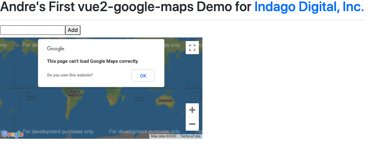

# google-maps demo for Indigo



I've prepared this demo to showcase my skills using Vuejs and the npm vue2-google-maps

## Project setup in local enviroment
```
Clone repo, then run 'npm run serve' in CL for testing. 

```

### Customize configuration
See [Configuration Reference](https://cli.vuejs.org/config/).
